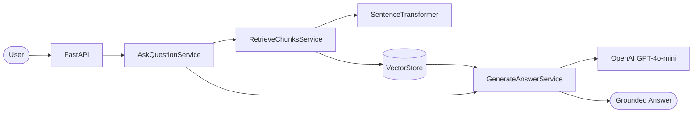
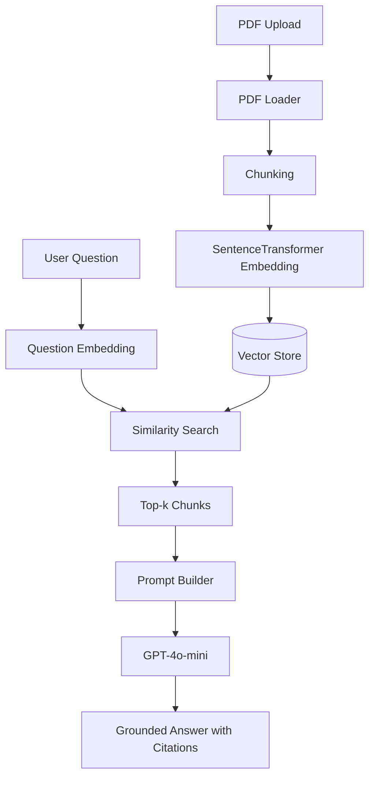

# Medical Guideline RAG


A citation-grounded Retrieval-Augmented Generation (RAG) system for searching medical guideline PDFs.

---

## Overview

Medical Guideline RAG is a demonstration project that implements a complete Retrieval-Augmented Generation pipeline using modern AI engineering practices.

The system allows users to:

- Upload medical guideline PDFs
- Build vector indexes
- Search using semantic similarity
- Generate grounded answers with GPT-4o-mini
- Return citations with every answer

This project demonstrates:

- Clean Architecture
- Domain Driven Design
- FastAPI
- Sentence Transformers
- OpenAI GPT-4o-mini
- Docker
- GitHub Actions
- Architecture Decision Records (ADR)

## Table of Contents

- Overview
- System Architecture
- RAG Workflow
- Tech Stack
- Features
- Requirements
- Setup
- Docker
- API
- Live End-to-End Verification
- Retrieval Evaluation
- Real-Data Retrieval Baseline
- Chunk Size Comparison
- Project Layout
- License

## System Architecture



## RAG Workflow



## Tech Stack

| Category | Technology |
|----------|------------|
| Language | Python 3.12 |
| Framework | FastAPI |
| Embedding | Sentence Transformers (intfloat/multilingual-e5-base) |
| LLM | OpenAI GPT-4o-mini |
| Vector Store | In-memory Vector Store |
| API Docs | Swagger UI |
| Dependency | uv |
| Testing | pytest |
| Lint | Ruff |
| Type Check | mypy |
| Container | Docker / Docker Compose |
| CI | GitHub Actions |

## Features

- Natural-language search over your own PDF guideline documents, with
  citations (source name, page number, similarity score) attached to
  every answer.
- Answers are grounded only in retrieved passages - never invented -
  with an explicit insufficient-evidence result when nothing relevant
  was found.
- Two HTTP endpoints (`POST /documents/index`, `POST /questions/ask`)
  with interactive Swagger UI docs, built on FastAPI.
- Runs fully offline out of the box (deterministic Fake embedding/LLM
  implementations, no API key or network access required), or with a
  real local `sentence-transformers` embedding model and the real
  OpenAI API selected via a couple of environment variables - see
  [Embedding](#embedding), [Generation](#generation), and
  [Live end-to-end verification](#live-end-to-end-verification-real-embedding--llm).
- A layered architecture (API / Application / Domain / Infrastructure)
  with an ADR (`docs/adr/`) recording the reasoning behind every major
  decision - see [Project layout](#project-layout).
- Runnable locally with `uv` or in a container with Docker Compose -
  see [Setup](#setup) and [Docker](#docker).

## Status

Minimal FastAPI setup with a health check endpoint, environment-based
settings, standard logging, a PDF loading foundation, a text chunking
foundation, an embedding foundation (Issue #6), a vector store
abstraction foundation (Issue #7), an indexing pipeline that composes
all of the above end to end (Issue #8), a retrieval use case
(Issue #9) that embeds a natural-language query and returns similar
chunks, a generation use case (Issue #10) that turns retrieved chunks
into a citation-grounded answer, a FastAPI RAG API (Issue #11) exposing
document indexing and question answering end to end, real
`Embedder`/`Llm` adapters (Issue #12: a local `sentence-transformers`
model and OpenAI's Chat Completions API), selectable alongside the
still-default Fake implementations via `Settings`, a verified, opt-in
live end-to-end test of the full stack with both real adapters
(Issue #13; see [Live end-to-end verification](#live-end-to-end-verification-real-embedding--llm)
below), and release readiness (Issue #14): a working `Dockerfile`/
`docker compose` setup (see [Docker](#docker)), an MIT
[License](#license), and a GitHub Actions CI workflow. No concrete
vector database adapter is implemented yet.

## Requirements

Either:

- Python 3.12 and [uv](https://docs.astral.sh/uv/), or
- Docker and Docker Compose - see [Docker](#docker) below.

## Setup

```bash
uv sync
cp .env.example .env
```

Edit `.env` as needed. All settings are environment variables prefixed
with `MEDICAL_RAG_` (see `app/core/config.py` and `.env.example` for
the full list). `.env` is not committed to Git.

Future plan: settings will be split per environment (Local / Test /
Staging / Production) instead of a single `Settings` class.

`uv sync` installs `sentence-transformers` (and its transitive
`torch`/`transformers` dependencies) and `openai` regardless of which
provider is configured; this is a sizeable download (hundreds of MB,
CPU-only). Both remain unused unless you opt in via
`MEDICAL_RAG_EMBEDDING_PROVIDER=sentence_transformers` and/or
`MEDICAL_RAG_LLM_PROVIDER=openai` - see [Embedding](#embedding) and
[Generation](#generation) below.

`tests/conftest.py` loads `.env` automatically (via `python-dotenv`, a
dev-only dependency) before tests are collected, so filling in
`.env` alone is enough to enable the opt-in live tests described in
[Live end-to-end verification](#live-end-to-end-verification-real-embedding--llm)
below - a real exported shell variable still takes precedence over
`.env` if both are set.

## Docker

```bash
cp .env.example .env
docker compose up --build
```

`docker compose` requires `.env` to already exist (it is passed to the
container via `env_file`); running it before `cp .env.example .env`
fails with a missing-file error. Once running, the API is reachable at
`http://localhost:8000` exactly as with `make dev` - `/docs` for
Swagger UI, `GET /api/v1/health` directly, etc.

The image (`Dockerfile`) installs `sentence-transformers`/`openai` the
same as a local `uv sync` (see [Setup](#setup)); by default it still
runs with the Fake providers, so no model download or API key is
required just to start the container. If you switch
`MEDICAL_RAG_EMBEDDING_PROVIDER=sentence_transformers` in `.env`, the
model downloads on first use into a named volume (`hf_cache`, mounted
at `/root/.cache/huggingface`), so it is **not** re-downloaded every
time the container is recreated - only when the volume itself is
removed (`docker compose down -v`).

`compose.yaml` runs the image as built (no source bind-mount); it is
meant to run the same thing you would deploy, not as a hot-reload dev
loop. For local development with auto-reload on file changes, use
`make dev` (plain `uv`) instead - see
[Development commands](#development-commands) below. A `HEALTHCHECK`
in the `Dockerfile` calls `GET /api/v1/health` every 30 seconds;
`docker ps`/`docker compose ps` reports the container as `healthy` once
the first check passes.

## Development commands

```bash
make dev        # run the API with uvicorn --reload
make lint       # ruff check
make format     # ruff format --check
make typecheck  # mypy
make test       # pytest
make check      # lint + typecheck + test
```

Once the server is running, open `http://127.0.0.1:8000/docs` for the
Swagger UI, or call `GET /api/v1/health` directly.

## PDF loading

Text-layer PDFs can be loaded page by page via any implementation of
the `app.domain.ports.pdf_loader.PdfLoader` interface, returning
immutable `DocumentPage` values. **PyMuPDF
(`app.infrastructure.pdf.pymupdf_loader.PyMuPdfLoader`) is the default
production extractor** (`MEDICAL_RAG_PDF_EXTRACTOR=pymupdf`), selected
in `app/api/dependencies.py`'s `get_pdf_loader()` based on
`Settings.pdf_extractor`. `pypdf`
(`app.infrastructure.pdf.pypdf_loader.PypdfLoader`) remains available
as a config-only rollback (`MEDICAL_RAG_PDF_EXTRACTOR=pypdf`); an
unrecognized value raises a clear error at startup. For the Japanese
medical guideline PDFs this project targets, extraction quality has a
large effect on downstream retrieval accuracy - a local, single-document
comparison found PyMuPDF's extracted text meaningfully more reliable
(fewer garbled/corrupted pages) and Recall/MRR substantially higher
than `pypdf`'s under an identical retrieval configuration; see
`docs/adr/0017-pdf-extraction-comparison-tooling.md`,
`docs/adr/0018-adopt-pymupdf-for-production-pdf-extraction.md` (which
also notes an open PyMuPDF license follow-up - AGPL-3.0/commercial dual
license - that must be resolved before any commercial or public
deployment), and `docs/pdf-extraction-comparison-results.md` for
anonymized aggregate figures. Scanned PDFs (image-only, no text layer)
and encrypted PDFs are not supported by either extractor; see
`docs/adr/0003-pdf-extraction-library.md` for the original reasoning
and constraints.

PDFs can be uploaded via `POST /api/v1/documents/index` (see
[API](#api) below). Only self-authored, license-free sample PDFs belong
under `data/sample/` (see `data/sample/README.md`); real or
copyrighted guideline PDFs must never be committed, and `data/raw/` is
git-ignored for that reason.

## Text chunking

`DocumentPage`s produced by the PDF loader can be split into
`Chunk`s for downstream embedding and search via
`app.infrastructure.chunking.fixed_size_text_splitter.FixedSizeTextSplitter`
(implements `app.domain.ports.text_splitter.TextSplitter`) together
with `app.application.services.chunk_document.ChunkDocumentService`,
which carries `document_id`, `page_number`, `source_name`,
`source_path`, and `title` from each page into its chunks.

Chunking is character-count based (not LangChain, not token-based) and
configured via `MEDICAL_RAG_CHUNK_SIZE` (default 1000) and
`MEDICAL_RAG_CHUNK_OVERLAP` (default 200). See
`docs/adr/0004-text-chunking-strategy.md` for the reasoning and
constraints.

## Embedding

`Chunk`s can be converted into `EmbeddedChunk`s (a `Chunk` plus a
`vector: list[float]`) via
`app.application.services.embed_chunks.EmbedChunksService`, which
delegates the actual vectorization to an injected
`app.domain.ports.embedder.Embedder` implementation
(`embed(texts: list[str]) -> list[list[float]]`). Empty input returns
an empty list without calling the embedder, and mismatched vector
counts or dimensions raise a domain-level `EmbeddingError` instead of
producing corrupted data.

By default the FastAPI app uses
`app.infrastructure.embedding.fake_embedder.FakeEmbedder`, a
deterministic, dependency-free stand-in with no network access. Setting
`MEDICAL_RAG_EMBEDDING_PROVIDER=sentence_transformers` switches to
`app.infrastructure.embedding.sentence_transformer_embedder.SentenceTransformerEmbedder`,
which runs a local, multilingual `sentence-transformers` model
(`MEDICAL_RAG_EMBEDDING_MODEL_NAME`, default
`intfloat/multilingual-e5-base`, downloaded on first use). That model
family is asymmetric - it needs a `"query: "` prefix for search queries
and a `"passage: "` prefix for indexed text - so the API layer actually
constructs two `Embedder`s sharing one loaded model
(`get_passage_embedder`/`get_query_embedder` in
`app/api/dependencies.py`), not one. See
`docs/adr/0005-embedding-strategy.md` for the original abstraction
decision and `docs/adr/0011-real-embedding-and-llm-adapters.md` for the
concrete adapter and provider-switching design.

## Vector store

`EmbeddedChunk`s can be stored and searched by similarity through the
`app.domain.ports.vector_store.VectorStore` Protocol
(`upsert(chunks: list[EmbeddedChunk]) -> None`,
`search(query_vector: list[float], top_k: int) -> list[SearchResult]`),
via `app.application.services.index_chunks.IndexChunksService` and
`app.application.services.search_chunks.SearchChunksService`. A
`SearchResult` pairs an `EmbeddedChunk` with a `score: float`, where a
higher score always means a closer match regardless of which
`VectorStore` implementation produced it; converting a concrete
backend's native distance metric into that convention is the
implementation's responsibility. `Chunk` exposes a computed `chunk_id`
property (`document_id:page_number:chunk_index`) used as a stable
identifier for upsert/deduplication.

No concrete vector database adapter (Qdrant, pgvector, Chroma) is
implemented yet. A deterministic, dependency-free implementation,
`app.infrastructure.vector_store.in_memory_vector_store.InMemoryVectorStore`,
is used both by tests and as the FastAPI app's default dependency
wiring (see [API](#api) below); its data does not survive a process
restart. See `docs/adr/0006-vector-store-strategy.md` for the
reasoning, including why `upsert` (not `add`) was chosen and the
`score` convention.

## Indexing pipeline

`app.application.services.index_document.IndexDocumentService` indexes
one PDF end to end by composing `LoadDocumentService`,
`ChunkDocumentService`, `EmbedChunksService`, and `IndexChunksService`
in sequence, returning an `IndexDocumentResult` (`document_id`,
`source_name`, `page_count`, `chunk_count`, `indexed_count`).
`document_id` is `None` for a zero-page PDF, since no `DocumentPage` is
produced in that case. Re-indexing the same PDF does not create
duplicate `VectorStore` entries, since it relies on the existing
`chunk_id`-based upsert idempotency
(`docs/adr/0006-vector-store-strategy.md`). Exceptions raised by any
step (document loading, chunking, embedding, storage) are not caught
and propagate to the caller unchanged. See
`docs/adr/0007-indexing-pipeline.md` for the reasoning.

This issue only builds the Application-layer pipeline and its tests;
there is no concrete embedding model or vector database adapter yet
(the API layer wires it to Fake implementations - see [API](#api)
below).

## Retrieval

`app.application.services.retrieve_chunks.RetrieveChunksService` takes
a natural-language query string and `top_k`, embeds the query via an
injected `Embedder`, and delegates the similarity search to an
injected `app.application.services.search_chunks.SearchChunksService`.
`top_k` and an empty/whitespace-only query are rejected before the
`Embedder` is called; a mismatch between the number of vectors the
`Embedder` returns and the single query it was given raises the
existing `EmbeddingCountMismatchError`. No new result model is
introduced: the return value is `list[SearchResult]`, the same type
`VectorStore.search`/`SearchChunksService.execute` already return.
Exceptions from the `Embedder` or `SearchChunksService` are not caught
and propagate to the caller unchanged. Logging includes only `top_k`
and the returned result count, never query text or vector values. See
`docs/adr/0008-retrieval-strategy.md` for the reasoning.

This issue only builds the Application-layer use case and its tests;
there is no concrete embedding model or vector database adapter yet
(see [API](#api) below for how it is exposed over HTTP today).

## Generation

`app.application.services.generate_answer.GenerateAnswerService` takes
a question and an already-retrieved `list[SearchResult]` (from
`RetrieveChunksService`) and generates a citation-grounded answer by
delegating to an injected `app.domain.ports.llm.Llm`
(`generate(prompt: str) -> str`). An empty/whitespace-only question is
rejected before the `Llm` is called. When `search_results` is empty,
the `Llm` is never called at all: a fixed insufficient-evidence answer
is returned instead, so the system can never invent an answer when no
guideline evidence was retrieved. `GenerationResult` (`answer`,
`citations: list[SearchResult]`, `is_insufficient_evidence`) reuses
`SearchResult` rather than introducing a separate citation model.
Logging includes only the citation count and the insufficient-evidence
outcome, never question text, guideline passage text, or the generated
answer text. See `docs/adr/0009-generation-strategy.md` for the
reasoning, including the current limitation that citations only carry
title/source name and page number (not edition/chapter/section, which
`Chunk` does not yet model).

The prompt instructs the `Llm` to answer only from the numbered
passages, to treat those passages as reference material rather than
instructions (so text inside a retrieved guideline can never redirect
the model's behavior), to never provide a medical diagnosis or a final
treatment decision, and to answer in Japanese. Before building the
prompt, `select_chunks_within_budget()` keeps only as many
highest-scoring passages as fit within
`MEDICAL_RAG_LLM_CONTEXT_MAX_CHARS` (default 6000 characters - a plain
character count, not a token count), never truncating a kept passage's
own text and always keeping at least the first passage even if it alone
exceeds the budget. `citations` reflects exactly this (possibly
narrowed) set - a passage dropped for length is never cited, since the
`Llm` never saw it. See
`docs/adr/0022-context-length-control-and-llm-error-handling.md` for
the full design.

Any exception from the injected `Llm` still propagates out of
`GenerateAnswerService` unchanged (fail-fast, per
`docs/adr/0009-generation-strategy.md`); `OpenAiLlm` itself translates
any exception raised by the OpenAI client into
`app.domain.exceptions.llm.LlmGenerationError` (never the raw SDK
exception, and never including the API key or other request detail),
which `POST /questions/ask` maps to HTTP 502.

By default the FastAPI app uses `app.infrastructure.llm.fake_llm.FakeLlm`,
a deterministic, dependency-free stand-in with no network access.
Setting `MEDICAL_RAG_LLM_PROVIDER=openai` (plus a real
`MEDICAL_RAG_LLM_API_KEY`) switches to
`app.infrastructure.llm.openai_llm.OpenAiLlm`, which sends the composed
prompt as a single user message to OpenAI's Chat Completions API
(`MEDICAL_RAG_LLM_MODEL_NAME`, default `gpt-4o-mini`). `llm_api_key` is
a `pydantic.SecretStr`, so it never appears in logs even if the whole
`Settings` object is accidentally printed. See
`docs/adr/0011-real-embedding-and-llm-adapters.md` for the adapter and
provider-switching design.

## API

Two endpoints expose the services above over HTTP, prefixed with
`Settings.api_v1_prefix` (default `/api/v1`):

- **`POST /documents/index`** - `multipart/form-data` upload of a
  single PDF (`file`). Rejects a non-`.pdf` file name (415) and an
  empty file (400). The upload is saved under a sanitized version of
  its own name inside a freshly-created, randomly-named temp
  directory - never under the raw uploaded name directly, and never in
  a predictable location - and the whole directory is always removed
  afterward, whether indexing succeeds or fails. Returns 201 with an
  `IndexDocumentResponse` (`document_id`, `source_name`, `page_count`,
  `chunk_count`, `indexed_count`) on success; an encrypted or
  unparseable PDF returns 422.
- **`POST /questions/ask`** - JSON body (`question`, `top_k`, default
  5). Composes `RetrieveChunksService` and `GenerateAnswerService` via
  the new `app.application.services.ask_question.AskQuestionService`.
  Returns 200 with an `AskQuestionResponse` (`answer`,
  `citations: list[CitationSchema]`, `is_insufficient_evidence`) -
  including when no evidence was retrieved, which is a normal result,
  not an error. An empty/whitespace-only question or non-positive
  `top_k` returns 400/422. A failure from the configured `Llm` (e.g. the
  OpenAI API) returns 502.

`app/api/dependencies.py` is the only module that constructs
Infrastructure implementations (Fake or real, depending on
`Settings.embedding_provider`/`llm_provider` - see
[Embedding](#embedding) and [Generation](#generation) above) and wires
them into Application services; endpoint modules never import
Infrastructure directly. `get_passage_embedder`/`get_query_embedder`/
`get_vector_store`/`get_llm` are process-wide singletons, so a document
indexed via `POST /documents/index` is searchable via
`POST /questions/ask` for the life of the running process (data is
lost on restart). Neither endpoint logs question text, guideline
passage text, generated answer text, or embedding vectors - only
counts, file names, and outcome flags.

There is no concrete vector database adapter yet (`InMemoryVectorStore`
remains the only `VectorStore`). Swagger UI at `/docs` can exercise
both endpoints directly, including file upload, regardless of which
providers are configured.

## Live end-to-end verification (real Embedding + LLM)

This confirms the full PDF-index -> chunk -> embed -> search -> answer
flow with the real `sentence-transformers` embedder and the real
OpenAI LLM, not the Fake stand-ins. See
`docs/adr/0012-live-e2e-verification.md` for the design reasoning.

**1. Required `.env` values** (no new settings beyond what
[Embedding](#embedding)/[Generation](#generation) already document):

```bash
MEDICAL_RAG_EMBEDDING_PROVIDER=sentence_transformers
MEDICAL_RAG_EMBEDDING_MODEL_NAME=intfloat/multilingual-e5-base
MEDICAL_RAG_LLM_PROVIDER=openai
MEDICAL_RAG_LLM_API_KEY=sk-...   # never commit a real key
```

Never commit `.env`, never paste a real API key into a commit, a log
line, a test assertion, an exception message, or this README. `llm_api_key`
is a `SecretStr` for exactly this reason (see [Generation](#generation)).

**2. Model download and caching.** The first request that uses
`sentence_transformers` downloads `intfloat/multilingual-e5-base`
(a few hundred MB) into the standard Hugging Face cache
(`~/.cache/huggingface`, or `%USERPROFILE%\.cache\huggingface` on
Windows; override with the `HF_HOME` environment variable). This can
take a few minutes on a slow connection; every request afterward
(including later runs of the app or the live test) reuses the cached
model and loads in a few seconds.

**3. Query/passage prefixes.** `sentence-transformers` models in the
`intfloat/multilingual-e5-*` family are asymmetric: the app already
applies a `"passage: "` prefix when indexing and a `"query: "` prefix
when searching (`get_passage_embedder`/`get_query_embedder` in
`app/api/dependencies.py`). There is nothing to configure; this is
confirmed functionally by the live test finding the right passage for
a related question, not by inspecting raw vectors.

**4. Vector dimension consistency.** `InMemoryVectorStore` records the
dimension of the first vector it stores and rejects any later vector of
a different size (`VectorDimensionMismatchError`). If you switch
`MEDICAL_RAG_EMBEDDING_MODEL_NAME` to a model with a different
dimension after already indexing documents, restart the app (or expect
this error) rather than mixing vectors from two models in the same
store.

**5. Running the live test:**

```bash
# .env filled in as above (loaded automatically by tests/conftest.py), or:
export MEDICAL_RAG_LLM_API_KEY=sk-...
export RUN_SLOW_TESTS=1

uv run pytest tests/integration/test_live_rag_e2e.py -v
```

`RUN_SLOW_TESTS=1` opts into the real model download/load;
`MEDICAL_RAG_LLM_API_KEY` opts into the real, billable OpenAI call. The
test is skipped unless **both** are present, and never runs as part of
a plain `uv run pytest`. It generates its own self-authored, obviously
fictional sample PDF (`tests/support/pdf_factory.build_pdf`) at run
time - no PDF is committed to this repository - and asserts only on
status codes, counts, and booleans (`chunk_count`, citation count,
`page_number`, `is_insufficient_evidence`, and that `answer` is
non-empty), never on API keys or exact document/answer text.

**6. Manual verification via Swagger UI**, as an alternative to the
live test:

1. Fill in `.env` as in step 1, then `make dev`.
2. Open `http://127.0.0.1:8000/docs`.
3. `POST /documents/index` -> "Try it out" -> upload any self-authored,
   non-confidential sample PDF (see `data/sample/README.md`; never a
   real guideline or patient document).
4. `POST /questions/ask` -> ask a question related to that PDF's
   content -> check `answer`, `citations` (source name, page number,
   score), and `is_insufficient_evidence` in the response.
5. Restarting the server clears `InMemoryVectorStore`
   ([Vector store](#vector-store)) - step 3 must be repeated after any
   restart before step 4 will find anything.

**7. Cost, timeout, and download time to expect:** a `gpt-4o-mini` call
for a short prompt (a handful of retrieved passages plus a question)
costs a small fraction of a cent; `MEDICAL_RAG_LLM_TIMEOUT_SECONDS`
(default 30) bounds how long `OpenAiLlm` waits for a response. The
`sentence-transformers` model download (step 2) is the slowest part of
a first run and depends entirely on network speed.

**8. Logging in error cases.** Both endpoints already log only counts,
file names, and outcome flags, never question text, document text, or
generated answer text ([API](#api)); this holds identically whether
the Fake or the real providers are configured. An API key is never
logged (`SecretStr`) and never appears in an `HTTPException` message
raised by either endpoint.

## Retrieval evaluation

`tests/integration/test_retrieval_evaluation.py` measures retrieval
quality only (never generation/LLM output, per `docs/requirements.md`'s
"separate retrieval quality from generation quality") using two
standard metrics computed in `tests/support/evaluation/metrics.py`:
**Recall@k** (does a relevant chunk appear anywhere in the top k
results?) and **MRR** (how high does the first relevant chunk rank,
averaged over all questions?). It indexes a fixed, self-authored,
fictional evaluation dataset
(`tests/support/evaluation/qa_dataset.py`: eight short sentences about
a made-up drug, each paired with a question and its expected page
number) with the real `sentence-transformers` embedder, then asserts
`Recall@3`/`MRR` clear provisional thresholds
(`MIN_RECALL_AT_3`/`MIN_MRR` in the test file) calibrated against that
dataset. See `docs/adr/0013-retrieval-evaluation.md` for the full
design reasoning.

Like the live tests above, it downloads a real model and is skipped
unless `RUN_SLOW_TESTS=1` is set - no OpenAI API key is needed, since
no `Llm` is involved:

```bash
RUN_SLOW_TESTS=1 uv run pytest tests/integration/test_retrieval_evaluation.py -v -s
```

`-s` prints a per-case report (Recall@k, reciprocal rank, expected vs.
actual page numbers for every question) alongside the pass/fail
result, which is what you need to recalibrate
`MIN_RECALL_AT_3`/`MIN_MRR` after growing `EVALUATION_CASES`.

## Real-data retrieval baseline

`scripts/evaluate_retrieval_baseline.py` measures Recall@1/Recall@3/
Recall@5/MRR of the current retrieval configuration against a real
guideline document kept entirely on your own machine - a one-off
baseline measurement, not a CI gate, and not an improvement (Issue
#18 is measurement only). The real PDF, the dataset of questions and
expected pages/chunks, and any per-question results are **never
committed**: `data/eval/` (alongside the existing `data/raw/`) is
gitignored for exactly this reason. Only the measurement tool itself,
the dataset format (`docs/evaluation-dataset-format.md`, fictional
examples only), and a place to record **aggregate** numbers
(`docs/baseline-retrieval-evaluation.md`, document titles anonymized)
are committed. See `docs/adr/0014-real-data-retrieval-baseline.md`
for the full design reasoning.

```bash
# .env: MEDICAL_RAG_EMBEDDING_PROVIDER=sentence_transformers
uv run python -m scripts.evaluate_retrieval_baseline \
  --dataset data/eval/my_guideline_qa.json --save-report
```

The script prints a per-question breakdown (local use only), an
aggregate summary, and a ready-to-review Markdown snippet for
`docs/baseline-retrieval-evaluation.md` - review it for anything
identifying before pasting it anywhere committed.

## Chunk size comparison

`scripts/compare_chunk_sizes.py` extends the same idea to compare
Recall@1/Recall@3/Recall@5/MRR across several `chunk_size` values
(default `300,500,700,1000,1500`) against the same real, local
dataset - `chunk_overlap`, `top_k`, and the embedding model are held
fixed. It shares its core index-and-evaluate logic with
`scripts/evaluate_retrieval_baseline.py` via
`scripts/retrieval_baseline_core.py`, but always uses an explicit,
CLI-specified configuration rather than reading `chunk_size` from
`.env` - this is a comparison measurement, not a change to any
default. As with the baseline tool, the real PDF, dataset, and
per-question results are **never committed**; only the tool and a
place to record **aggregate** comparison results
(`docs/chunk-size-comparison.md`, document titles anonymized) are. See
`docs/adr/0015-chunk-size-comparison.md` for the full design
reasoning.

```bash
uv run python -m scripts.compare_chunk_sizes \
  --dataset data/eval/my_guideline_qa.json --save-report
```

Prints a comparison table (aggregate only, by default) and a
ready-to-review Markdown table for `docs/chunk-size-comparison.md`.
Pass `--verbose` to also print each candidate's per-question
breakdown (local use only).

## PDF extraction comparison

`scripts/compare_pdf_extractors.py` compares PDF text-extraction
strategies (`pypdf`, PyMuPDF) against the same real, local dataset:
for each extractor, it measures extraction-quality statistics (page/
character counts, a comparison-only garbled-text heuristic - see
`docs/adr/0017-pdf-extraction-comparison-tooling.md` for what it does
and does not detect) alongside Recall@1/Recall@3/Recall@5/MRR under a
fixed configuration (`chunk_size=1000`, `chunk_overlap=200`,
`top_k=5`, `intfloat/multilingual-e5-base`). It reuses
`scripts/retrieval_baseline_core.py`'s retrieval evaluation, injecting
each extractor's already-extracted pages. This tool always compares
both extractors' output directly, independent of which one is
currently configured as the production default via
`MEDICAL_RAG_PDF_EXTRACTOR` (see [PDF loading](#pdf-loading) above -
PyMuPDF is the default since
`docs/adr/0018-adopt-pymupdf-for-production-pdf-extraction.md`, with
`pypdf` kept for rollback and future comparisons). As with
the other tools above, the real PDF, dataset, and per-question results
are **never committed**; only the tool and a place to record
**aggregate** comparison results
(`docs/pdf-extraction-comparison-results.md`, document titles
anonymized) are. See
`docs/adr/0016-retrieval-quality-diagnosis.md`/
`docs/adr/0017-pdf-extraction-comparison-tooling.md` for the full
design reasoning.

```bash
uv run python -m scripts.compare_pdf_extractors \
  --dataset data/eval/my_guideline_qa.json --save-report
```

Prints a comparison table (aggregate only, by default) and a
ready-to-review Markdown table for
`docs/pdf-extraction-comparison-results.md`. Pass `--verbose` to also
print each extractor's per-question breakdown (local use only).

## Table-aware chunking comparison

`scripts/compare_chunking_strategies.py` compared the existing
fixed-size chunker against a rule-based table-aware chunker
(`scripts/table_aware_chunking.py`) under a fixed `hybrid_rerank`
retrieval configuration. On a real guideline PDF it underperformed the
existing chunker on Recall@1/Recall@3/Recall@5/MRR, and its latency
improvement was too small to offset that regression - **it was
compared but is not adopted**. Production chunking remains
`FixedSizeTextSplitter`. See
`docs/adr/0021-table-aware-chunking-comparison.md` and
`docs/table-aware-chunking-comparison-results.md` for the full design
and recorded results.

## Project layout

See `docs/architecture.md` for the layered architecture and
`CLAUDE.md` for the full set of project rules.

```
app/            # application source (api, application, domain, infrastructure, core, schemas)
tests/          # unit, integration, api tests
docs/           # requirements, architecture, ADRs
scripts/        # development and operational scripts
data/           # raw, processed, and sample guideline data (see data/sample/README.md)
```

## License

[MIT](LICENSE).

## Author

ToruCode

Clinical Engineer (10 years)

AI Engineer

Medical AI / RAG / Machine Learning