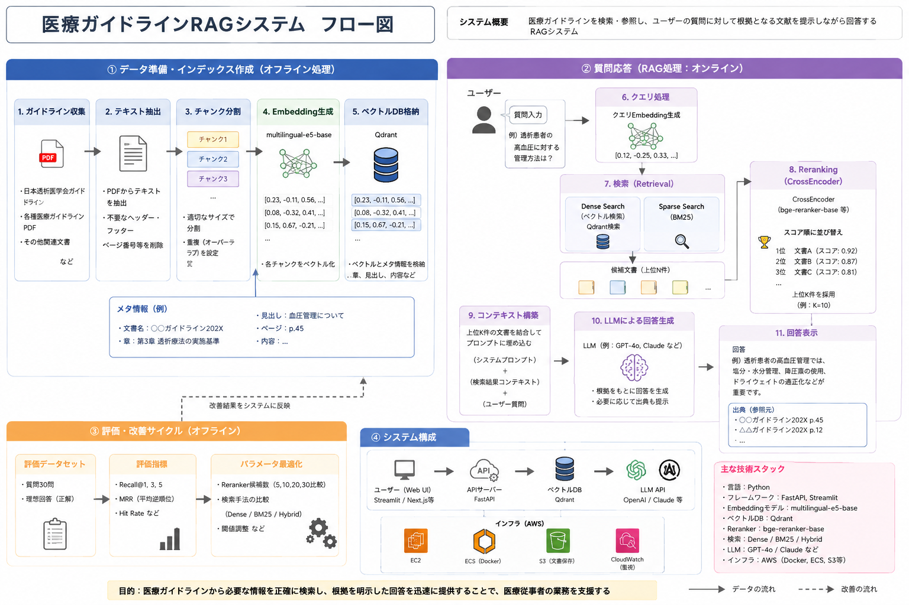
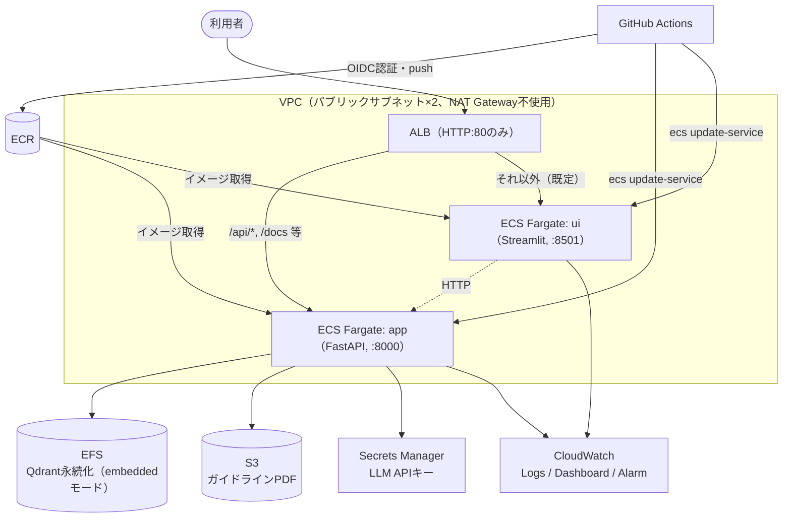
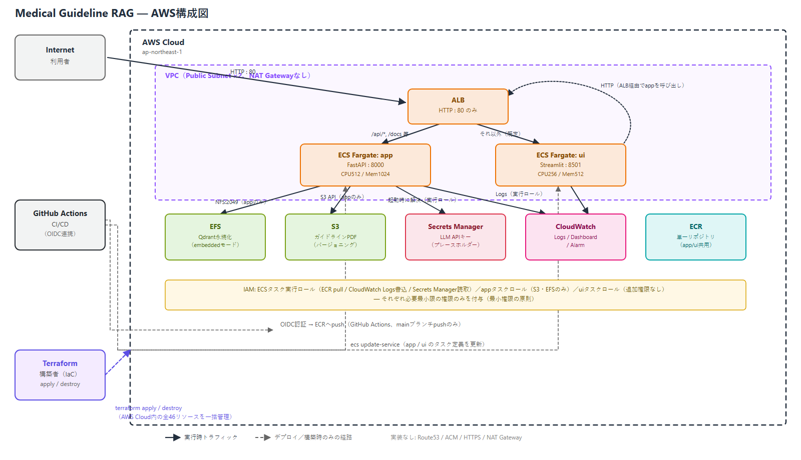

# Medical Guideline RAG


医療ガイドラインPDFを対象に、引用根拠付きで検索・回答するRAG（Retrieval-Augmented
Generation）システムです。Python / FastAPI / Streamlit / LangChain非依存の自前実装で構築し、
Docker Composeでローカル完全再現できる構成にしています。Terraformで構築したAWS ECS
Fargate環境（ALB・EFS・S3・Secrets Manager・CloudWatch）に実際にデプロイし、FastAPI /
Streamlitの正常稼働とヘルスチェック成功を実機で検証、検証後は `terraform destroy` まで実施して
コストを発生させない運用まで確認しました。

## Highlights

- **Terraform**: VPC・ALB・ECS Fargate・EFS・S3・Secrets Manager・CloudWatch・IAM（GitHub
  Actions OIDC含む）一式をコード化し、46リソースを一括applyで構築
- **AWS ECS Fargate**: FastAPI（app）・Streamlit（ui）の2サービスをFargateで実稼働
- **Docker**: 同一イメージをapp/ui両サービスで共用（コマンド上書きのみ）、`docker compose`で
  ローカル完全再現
- **ECR**: CIからのイメージビルド・push、ライフサイクルポリシーによる自動クリーンアップ
- **ALB**: パスベースルーティング（`/api/*` → app、それ以外 → ui）、ヘルスチェック運用
- **FastAPI**: `/api/v1/health` が実機で HTTP 200 を返すことを確認
- **Streamlit**: トップページが実機で HTTP 200 を返すことを確認
- **CloudWatch**: Logs / Dashboard / Alarmを構築し、正常起動ログを実機で確認
- **`terraform destroy` まで実施**: 検証後は全リソースを削除し、課金が残らないことをAWS CLIで確認済み

---

## 目次

- [プロジェクト概要](#プロジェクト概要)
- [解決したい課題](#解決したい課題)
- [主な機能](#主な機能)
- [デモ・動作確認](#デモ動作確認)
- [システム構成](#システム構成)
- [技術スタック](#技術スタック)
- [AWS構成](#aws構成)
- [Terraform管理対象](#terraform管理対象)
- [ディレクトリ構成](#ディレクトリ構成)
- [ローカル実行手順](#ローカル実行手順)
- [AWSデプロイ手順の概要](#awsデプロイ手順の概要)
- [テスト・品質管理](#テスト品質管理)
- [セキュリティ設計](#セキュリティ設計)
- [コスト設計](#コスト設計)
- [工夫した点](#工夫した点)
- [苦労した点と解決方法](#苦労した点と解決方法)
- [評価方法](#評価方法)
- [制約・免責事項](#制約免責事項)
- [今後の改善](#今後の改善)
- [ライセンス](#ライセンス)
- [このプロジェクトで得られたこと](#このプロジェクトで得られたこと)

---

## プロジェクト概要

Medical Guideline RAGは、医療ガイドラインPDFを対象とした引用根拠付きRAGシステムです。
アップロードしたPDFをチャンク分割・ベクトル化してインデックスし、自然言語の質問に対して
「取得した文書の範囲内だけ」で根拠付きの回答を生成します。生成に使える根拠が見つからない場合は
「根拠不十分」という結果を明示的に返し、モデルが情報を捏造しないことを設計上保証しています。

このプロジェクトは技術デモンストレーションであり、医療診断・個別患者への治療判断・
患者固有の推奨は一切行いません。

Clean Architecture / Domain-Driven Designに基づく4層構成（API / Application / Domain /
Infrastructure）を採用し、主要な設計判断はすべて Architecture Decision Record（ADR、
`docs/adr/` 配下に29件）として記録しています。

## 解決したい課題

医療ガイドラインは数百ページに及ぶことも多く、必要な情報を人手で探すのは時間がかかります。
また、汎用のLLMにそのまま質問すると、ガイドラインに書かれていない内容を「それらしく」
生成してしまうリスク（ハルシネーション）があり、医療分野では特に致命的です。

本プロジェクトは、次の2点を技術的に解決することを目標にしています。

- 自然言語の質問から、関連する原文パッセージを高速に検索できること
- 生成される回答が、検索されたパッセージの範囲を超えて情報を捏造しないこと（引用根拠が
  必ず一致すること）、根拠が無ければ「わからない」と正直に返すこと

## 主な機能

- 自分のPDFガイドライン文書に対する自然言語検索。すべての回答に出典名・ページ番号・
  類似度スコアを引用として付与
- 回答は検索済みパッセージのみから生成（捏造しない）。関連パッセージが見つからない場合は
  「根拠不十分」という結果を明示的に返却
- `POST /documents/index`（PDFインデックス登録）、`POST /questions/ask`（質問応答）の
  2エンドポイント。Swagger UIによるインタラクティブなAPIドキュメント付き
- APIキーやネットワーク接続なしで完全オフライン動作可能（決定論的なFake実装）。環境変数の
  切り替えのみで、実際のsentence-transformersモデル・OpenAI APIに切り替え可能
- API/Application/Domain/Infrastructureの層構造と、全設計判断を記録したADR
- `uv`によるローカル実行、または`docker compose`によるコンテナ実行の両対応
- 質問応答と引用確認ができるStreamlit製デモUI
- 検索精度（Recall@k / MRR）・回答品質（引用の精度・再現率など）を測定する評価ツール群
- **比較実験専用の検索改善パイプライン**（本番未採用、詳細は[評価方法](#評価方法)参照）:
  Hybrid Search（Dense＋BM25）、Cross-Encoderによるリランキング、表構造対応チャンキング

## デモ・動作確認

### ローカル環境（Docker Composeで再現可能）

```bash
cp .env.example .env
docker compose up --build
```

- API: `http://localhost:8000/docs` （Swagger UI）
- Streamlit UI: `http://localhost:8501`

APIキー・ネットワーク接続なしで起動できる決定論的なFake実装がデフォルトのため、
上記コマンドだけですぐに動作確認できます。

### AWS環境での実機検証（実施・完了済み、現在は削除済み）

以下を実際のAWS環境（ap-northeast-1）で検証しました。

| 項目 | 結果 |
|---|---|
| Dockerイメージのビルド・ECRへのpush | 成功 |
| Terraformによる46リソースの一括構築（`terraform apply`） | 成功 |
| ECS Fargate上でapp（FastAPI）・ui（Streamlit）が起動 | 成功（running=1, pending=0） |
| ALBのTarget Group（app / ui） | ともに `healthy` |
| ALB経由 `GET /api/v1/health` | HTTP 200、`{"status":"ok",...}` |
| ALB経由 `GET /`（Streamlitトップページ） | HTTP 200 |
| CloudWatch Logsでの起動ログ確認 | エラーなし、正常起動を確認 |
| 検証後 `terraform destroy` | 成功（47/48リソース即時削除、ECRはイメージ削除後に再実行し完全削除） |
| `terraform state list`（destroy後） | 空（管理対象リソース0件） |

**現在、AWS上にはこのプロジェクトのリソースは何も存在しません。** 継続的に課金が発生する
構成（Fargate・ALB・EFS等）のため、検証後は速やかに`terraform destroy`する運用としています。
再現する場合は[AWSデプロイ手順の概要](#awsデプロイ手順の概要)を参照してください。

### ローカルRAG検証の再現

起動中のAPI（`make dev`等）に対して、PDFのインデックス登録から質問応答までを実際のHTTPリクエストで
検証し、HTTPステータス・処理時間・引用ページ・スコア・回答文字数などをJSONで保存できます。

```bash
uv run python -m scripts.verify_live_rag \
  --pdf data/raw/your_guideline.pdf \
  --question "質問文" \
  --save-report
```

`curl`やPowerShellで日本語を直接送信する場合に起きがちな文字化け・JSON解析エラーを避けるため、
`httpx`（UTF-8で一貫してエンコードするHTTPクライアント）経由でリクエストを送信します。保存される
レポート（`data/eval/results/`、gitignore対象）の出力形式サンプルは
[`docs/examples/live_verification_sample.json`](docs/examples/live_verification_sample.json)
（架空データ）を参照してください。

### スクリーンショットについて

現時点でリポジトリ内にポートフォリオ掲載用のスクリーンショットは存在しません。追加する場合は
以下の保存先・ファイル名を推奨します（自己作成の非機密サンプル文書を用いたもののみ）。

- `docs/images/streamlit-ui.png` — Streamlitデモ画面
- `docs/images/swagger-ui.png` — Swagger UI（`/docs`）
- `docs/images/cloudwatch-logs.png` — CloudWatch Logsの正常起動ログ
- `docs/images/ecs-target-group-healthy.png` — ALB Target Groupのhealthy状態

## システム構成

本システムは、医療ガイドラインPDFを対象として、Embedding、Hybrid Search、CrossEncoder
Reranking、LLMを組み合わせたRAG（Retrieval-Augmented Generation）システムです。

PDFから抽出・分割したテキストをEmbeddingし、Qdrantへ格納します。質問時にはDense Searchと
BM25を組み合わせたHybrid Searchで候補文書を取得し、CrossEncoderによるRerankingを行った
うえで、上位文書をLLMへ渡して回答を生成します。

また、30問の評価データセットを用いてRecall@1/3/5・MRRを計測し、検索方式やRerankerの
候補件数などを比較・最適化しています（詳細は[評価方法](#評価方法)参照）。



### AWSインフラ構成（実際にterraformで構築・検証した構成）



ECS Fargateタスクはパブリックサブネットに配置されますが、セキュリティグループにより
ALB以外からの直接アクセスは遮断されています（詳細は[セキュリティ設計](#セキュリティ設計)）。

上記Mermaid図の詳細版として、AWS公式アイコンを用いた構成図も用意しています。



編集用ソース（draw.io形式）: [`docs/images/aws-architecture.drawio`](docs/images/aws-architecture.drawio)

## 技術スタック

| カテゴリ | 技術 |
|---|---|
| 言語 | Python 3.12 |
| Webフレームワーク | FastAPI |
| Embedding | Sentence Transformers（`intfloat/multilingual-e5-base`） |
| LLM | OpenAI GPT-4o-mini |
| Vector Store | In-memory（既定）/ Qdrant（embedded/localモード、永続化） |
| APIドキュメント | Swagger UI |
| 依存管理 | uv |
| テスト | pytest |
| Lint | Ruff |
| 型チェック | mypy |
| コンテナ | Docker / Docker Compose |
| CI/CD | GitHub Actions |
| IaC | Terraform |
| クラウド | AWS（ECS Fargate / ALB / EFS / S3 / Secrets Manager / CloudWatch / IAM） |

検索改善の比較実験（本番未採用）では、自前実装のBM25・日本語トークナイザー、
Cross-Encoderリランキングモデル（`cross-encoder/mmarco-mMiniLMv2-L12-H384-v1`）も使用しています。

## AWS構成

Terraformで構築した本番相当のAWS構成です（[デモ・動作確認](#デモ動作確認)で実機検証済み）。

- **ECS Fargate**: `app`（FastAPI、CPU 512 / Memory 1024）と`ui`（Streamlit、CPU 256 /
  Memory 512）の2サービス。同一のDockerイメージを使い、uiのみコンテナ起動コマンドを
  上書き（`streamlit run ...`）
- **ALB**: HTTPのみ（80番）。`/api/*`, `/docs`, `/openapi.json`, `/redoc` はappへ、
  それ以外はuiへパスベースで転送。ヘルスチェックはapp: `/api/v1/health`、ui: `/_stcore/health`
- **EFS**: Qdrantのembedded/localモード用の永続ストレージ。IAM認可（Access Point経由）で
  appタスクのみマウント可能
- **S3**: ガイドラインPDF保管用。バージョニング有効、非現行バージョンは90日で自動失効、
  パブリックアクセスは完全ブロック
- **Secrets Manager**: OpenAI APIキー用。Terraformはプレースホルダー値のみを作成し、
  実キーはAWS CLIで別途（out-of-band）登録する設計
- **CloudWatch**: app/uiそれぞれのLog Group、CPU/Memory使用率・ALBリクエスト数・5xx数を
  可視化するDashboard、5xx多発・unhealthyホスト検知のAlarm
- **IAM**: ECSタスク実行ロール・appタスクロール・uiタスクロールを分離し、それぞれ必要最小限の
  権限のみ付与。GitHub Actionsのデプロイは長期AWSキーを使わずOIDC連携で実施
- **NAT Gatewayは意図的に不使用**: Fargateタスクはパブリックサブネットに配置しつつ、
  セキュリティグループで直接アクセスを遮断する構成とし、NAT Gatewayの固定費（月$32〜70）を
  回避

設計判断の詳細は`docs/adr/0029-aws-ecs-fargate-deployment.md`に記録しています。

## Terraform管理対象

`terraform/`配下で以下のリソースをコード管理しています（機微情報を含むため、実際のARN・
アカウントID・DNS名等はREADMEに記載していません）。

| カテゴリ | 内容 |
|---|---|
| ネットワーク | VPC、Internet Gateway、パブリックSubnet×2、Route Table |
| Security Group | ALB用、app用、ui用、EFS用（計4つ、相互に最小権限で連携） |
| ALB | Load Balancer、Listener（HTTP）、Listener Rule、Target Group×2 |
| ECS | Cluster、Task Definition×2、Service×2 |
| EFS | File System、Access Point、Mount Target×2（2AZ分） |
| S3 | Bucket、Versioning、Lifecycle Configuration、Public Access Block |
| Secrets Manager | Secret、Secret Version（プレースホルダー） |
| IAM | Role×4、Role Policy×5、Policy Attachment×1、GitHub Actions用OIDC Provider |
| CloudWatch | Log Group×2、Dashboard、Metric Alarm×2 |
| ECR | Repository、Lifecycle Policy（未タグイメージを7日で自動失効） |

`terraform apply`で計46リソース、`terraform destroy`で48リソース（構築後に増えたECSタスク等の
実体を含む）を一括管理できることを実機で確認しています。

## ディレクトリ構成

```
app/
├── api/              # FastAPIエンドポイント・依存性注入（app/api/dependencies.py）
├── application/      # ユースケース層（Application Service）
│   └── services/
├── domain/           # エンティティ・値オブジェクト・Port（Protocol）定義
│   ├── models/
│   ├── ports/
│   └── exceptions/
├── infrastructure/   # 外部ライブラリ実装（PDF/Embedding/LLM/VectorStore/Storage）
│   ├── pdf/
│   ├── chunking/
│   ├── embedding/
│   ├── llm/
│   ├── vector_store/
│   └── storage/
├── core/             # 設定・ロギング・共通定数
├── schemas/          # Pydanticリクエスト/レスポンススキーマ
└── ui/               # Streamlitデモ UI・評価ダッシュボード

tests/
├── unit/             # ドメイン・アプリケーション層の単体テスト
├── integration/      # パイプライン結合テスト、opt-inの実モデル/実API検証
├── api/              # FastAPIエンドポイントのテスト
└── support/          # テスト用ヘルパー（PDF生成、評価データセット定義）

scripts/              # 開発・運用・比較評価用スクリプト（インデックス登録、各種評価CLI）
docs/
├── adr/              # Architecture Decision Record（29件）
└── *.md              # 要件定義・アーキテクチャ・評価結果ドキュメント

terraform/            # AWSインフラのIaC定義一式
data/                 # raw/processed/sample/eval（実データ・評価データはgitignore対象）
.github/workflows/    # CI/CDパイプライン（lint/format/typecheck/test、AWSデプロイ）
Dockerfile
compose.yaml
```

## ローカル実行手順

Python 3.12 + [uv](https://docs.astral.sh/uv/)、またはDocker / Docker Composeのいずれかが必要です。

### uvで直接実行

```bash
uv sync
cp .env.example .env
make dev   # http://127.0.0.1:8000/docs
make ui    # 別ターミナルで、http://localhost:8501
```

設定はすべて`MEDICAL_RAG_`プレフィックス付きの環境変数です（`app/core/config.py`と
`.env.example`参照）。デフォルトはAPIキー・ネットワーク接続不要な決定論的Fake実装です。

### Docker Composeで実行

```bash
cp .env.example .env
docker compose up --build
```

`app`（FastAPI, 8000番）と`ui`（Streamlit, 8501番）が同時起動し、Qdrant永続ボリューム
（embedded/localモード、別サーバー不要）で状態を保持します。PDFのインデックス登録は

```bash
docker compose run --rm app uv run --frozen --no-dev python -m scripts.index_documents
```

で実行します（`data/raw/`配下のPDFを対象。自己作成の非機密サンプルのみ使用してください）。

### 開発コマンド

```bash
make dev        # uvicorn --reloadでAPI起動
make lint       # ruff check
make format     # ruff format --check
make typecheck  # mypy
make test       # pytest
make check      # lint + typecheck + test
```

## AWSデプロイ手順の概要

詳細な手順・トラブルシューティングは`docs/deployment-guide.md`に記載しています。ここでは
概要のみ示します（実際のアカウントID・ARN等の機微情報は含みません）。

1. **Terraformでインフラを構築**
   ```bash
   cd terraform
   cp terraform.tfvars.example terraform.tfvars
   terraform init
   terraform plan   # 作成されるリソースを必ず確認
   terraform apply  # 実リソースを作成（課金が発生し始める）
   ```
2. **GitHub Actionsのデプロイ設定**（初回のみ）: リポジトリ設定に、Terraformの出力値から
   `AWS_DEPLOY_ROLE_ARN`（Repository secret）と`AWS_REGION`（Repository variable）を登録。
   長期のAWSアクセスキーは一切使用せず、OIDC経由で一時クレデンシャルを取得する構成です。
3. **初回イメージのブートストラップ**: `main`ブランチへのpushでCI/CDが自動的にビルド・
   ECRへpush・ECSサービス更新まで実施します。手動でイメージをpushする代替手順も用意しています。
4. **実際のOpenAI APIキーへの切替**（任意）: Terraformはプレースホルダー値のみ作成するため、
   `aws secretsmanager put-secret-value`で別途登録し、`llm_provider = "openai"`に変更して
   再applyします。
5. **停止・削除**
   ```bash
   cd terraform
   terraform destroy  # 作成した全リソースを削除し、課金を停止
   ```

継続稼働させると月額約$40〜70のコストが発生するため（[コスト設計](#コスト設計)参照）、
検証用途では検証後に必ず`terraform destroy`する運用を推奨します（本プロジェクトでも
この運用を実施済みです）。

## テスト・品質管理

- **pytest**: 501件のテストを収集（unit / integration / api の3層）。LLM呼び出しは
  ユニットテストでは原則モック化し、実際のOpenAI API・sentence-transformersモデルを使う
  テストは`RUN_SLOW_TESTS=1`指定時のみ実行するopt-in方式（CIでは常にスキップ）
- **Ruff**: lintとフォーマットチェック
- **mypy**: 型チェック（`disallow_untyped_defs`等、厳格めの設定）
- **GitHub Actions CI**: `main`へのpush・PR全件に対して lint → format → typecheck → test を
  自動実行。すべて通過したPRのみdeployジョブに進む構成

```bash
make check   # lint + typecheck + test をまとめて実行
```

## セキュリティ設計

- **秘密情報の取り扱い**: LLM APIキーは`pydantic.SecretStr`で保持し、`Settings`オブジェクトを
  誤って出力してもログに漏れない設計。質問文・パッセージ本文・生成回答本文はいずれのログにも
  一切出力せず、件数や真偽フラグのみ記録
- **アップロード処理**: PDFファイル名はサニタイズした上で、都度ランダム生成した一時ディレクトリに
  保存し、成功・失敗に関わらず処理後に必ず削除
- **IAM最小権限**: ECSタスク実行ロールは指定した1つのSecrets Manager シークレットの読み取りのみ、
  appタスクロールは対象S3バケットとEFS Access Point（ARN指定）のみに権限を限定、
  uiタスクロールには追加権限を一切付与しない
- **ネットワーク分離**: ALBのみが外部公開（80番）。app（8000番）・ui（8501番）はALBの
  セキュリティグループからの通信のみ許可。EFS（2049番）はappタスクのセキュリティグループ
  からのみ許可。ECS Fargateタスクはパブリックサブネットに配置されるが、セキュリティグループが
  実質的な唯一の防御層として機能
- **S3**: パブリックアクセスを完全ブロック（ACL・ポリシーとも）
- **GitHub Actions**: 長期のAWSアクセスキーをGitHub Secretsに保存せず、OIDC連携で
  `main`ブランチからのpushに限定した一時クレデンシャルを使用
- **Secrets Manager**: Terraformはプレースホルダー値のみを作成し、実キーはコード経由では
  一切扱わない設計（`lifecycle.ignore_changes`で手動設定値の上書きも防止）

## コスト設計

継続稼働させた場合、月額約**$40〜70**が目安です（トラフィックゼロでも発生）。

| リソース | 課金要因 |
|---|---|
| ECS Fargate | app（0.5vCPU/1GB）+ ui（0.25vCPU/0.5GB）の稼働時間課金 |
| ALB | 固定時間課金 + LCU従量課金（停止機能がなく、destroyするまで課金継続） |
| EFS | ストレージ容量課金 |
| CloudWatch | Logs保存・Dashboard・Alarm |
| S3 | ストレージ・リクエスト課金 |
| ECR | イメージストレージ課金 |
| Secrets Manager | シークレット1件あたりの月額固定費 |

**コストを抑える設計判断**:

- NAT Gatewayを意図的に不使用（月$32〜70の固定費を回避、代わりにセキュリティグループで
  ネットワーク分離）
- ECRライフサイクルポリシーで未タグイメージを7日後に自動失効
- S3ライフサイクルで非現行バージョンを90日後に自動失効
- HTTPS/ACM/Route53は未構成（ドメイン未取得のため、必要になった時点で追加する設計）

本プロジェクトでは、[デモ・動作確認](#デモ動作確認)の実機検証後に`terraform destroy`まで
実施し、継続課金が発生しない状態を確認済みです。

## 工夫した点

- **Clean Architecture + DDDの徹底**: API/Application/Domain/Infrastructureの依存方向を
  厳密に守り、Domain層はFastAPI・LangChain・Qdrant・AWS SDK等いかなるフレームワークにも
  依存しない設計。すべての主要判断を29件のADRとして記録し、後から意思決定の理由を追跡可能に
- **Fail-fast設計**: 各Application Serviceは例外を握りつぶさず、ドメイン固有の例外
  （`EmbeddingError`, `VectorStoreError`等）として上位に伝播させ、API層で適切なHTTP
  ステータスに変換
- **Provider切り替え可能な設計**: Embedding/LLM/VectorStore/Storageをすべて環境変数で
  Fake実装と実実装に切り替え可能にし、APIキーやネットワークなしでの開発・CI実行と、
  本番相当の実行を同じコードベースで両立
- **文字数予算を考慮したプロンプト構築**: `MEDICAL_RAG_LLM_CONTEXT_MAX_CHARS`の範囲内で
  スコア上位のパッセージのみを採用し、採用されなかったパッセージは引用にも含めない
  （見せていない根拠を引用したことにしない）設計
- **Embedded QdrantをEFSに配置**: 別途Qdrantサーバーを運用せず、embedded/localモードを
  EFS上に永続化することでインフラをシンプルに保持
- **GitHub Actions OIDC連携**: 長期のAWSアクセスキーを一切保存せず、ワークフロー実行時に
  一時クレデンシラルを取得する構成でCI/CDのセキュリティを確保
- **比較実験を本番コードから完全分離**: Hybrid Search・Cross-Encoderリランキング・
  表構造対応チャンキングの比較実装はすべて`scripts/`配下に閉じ込め、`app/domain`・
  `app/application`・`app/infrastructure`・`app/api/dependencies.py`には一切手を加えない
  方針を徹底（本番の振る舞いへの影響ゼロを保証）

## 苦労した点と解決方法

- **Embedded Qdrantの単一プロセス制約**: embedded/localモードのQdrantは1プロセスしか
  同じパスを開けないため、ECSの標準的なローリングデプロイ（新旧タスクが一時的に共存）では
  衝突する。→ appサービスのみ`deployment_minimum_healthy_percent=0`の「Recreate」方式を
  採用し、旧タスクを完全停止してから新タスクを起動する設計に変更（意図的な短時間停止を許容）
- **日本語ガイドラインのPDF抽出品質**: `pypdf`では文字化け・欠損が多く見られたため、
  `PyMuPDF`と比較評価。Recall/MRRが明確に向上したためPyMuPDFを採用（ただしAGPL-3.0/
  商用デュアルライセンスである点は商用利用前に要解決の課題として記録）
- **ECS/ALB作成前にイメージが存在しない問題**: `terraform apply`はECSサービスまで作成するが、
  ECRリポジトリは空の状態で始まるため、初回はタスク起動に失敗する。→ GitHub Actionsの
  デプロイジョブで解決する手順と、手動でイメージをpushする代替手順の両方を用意
- **`terraform destroy`がECRリポジトリで失敗**: 検証後の削除時、ECRリポジトリにイメージが
  残っていたため`force_delete`未設定のTerraformコードでは削除できずエラーになった。
  → Terraformコードは変更せず、`aws ecr batch-delete-image`でイメージを先に削除してから
  `terraform destroy`を再実行し、全リソースの削除に成功
- **Windows（Git Bash）でのAWS CLI実行時のパス変換問題**: `/ecs/...`のようにスラッシュで
  始まる引数をAWS CLIに渡すと、Git BashがPOSIXパスとして誤変換してしまう事象が発生。
  → `MSYS_NO_PATHCONV=1`を指定することで回避

## 評価方法

- **検索精度**: Recall@k（正解チャンクがTop-k内に含まれるか）とMRR（最初の正解チャンクの
  順位の逆数の平均）を`tests/support/evaluation/metrics.py`で自前実装し測定
- **回答品質**: LLM-as-a-Judgeは使わず、決定論的な指標のみで評価 — 引用の精度/再現率、
  根拠不十分判定の正確さ、字句一致ベースの回答網羅率、引用一貫性チェック
  （生成された引用が実際に検索結果の部分集合になっているか）
- **CIで常時実行される評価**: 自己作成の合成データセット（架空の薬剤に関する短い文章8件）を
  使い、`RUN_SLOW_TESTS=1`指定時にRecall@3/MRRのしきい値を検証するテストとして常設
- **実データでの比較実験ツール**（ローカル限定、実ガイドラインPDF・データセットは
  一切コミットしない設計）:
  - チャンクサイズ比較（`scripts/compare_chunk_sizes.py`）
  - PDF抽出器比較（pypdf vs PyMuPDF、`scripts/compare_pdf_extractors.py`）
  - Hybrid Search比較（Dense単独 vs Dense+BM25、`scripts/compare_retrieval_strategies.py`）
  - Cross-Encoderリランキング比較（`scripts/compare_reranking_strategies.py`）
  - 表構造対応チャンキング比較（`scripts/compare_chunking_strategies.py`）

**正直な補足**: 上記5つの比較ツールのうち、実際に数値を記録済みなのは**表構造対応チャンキング
比較・Hybrid Search比較・Cross-Encoderリランキング比較の3件**です（結果は各`docs/*.md`参照）。
残る2件（チャンクサイズ、PDF抽出器）は、ツール自体は実装・テスト済み（`tests/unit/`に単体テスト
あり）で実データに対して即座に実行可能な状態ですが、結果ドキュメントはまだ空のテンプレートの
ままです。ツールの実装・テストと、実データでの計測実施は明確に区別しています。

**Cross-Encoderリランキングのcandidate_k調整（2026-08-09実施）**: Hybrid+Rerankの
`reranker_candidate_k`（Rerankerに渡す候補数）を5/10/20/30で比較したところ、10が最も妥当な
トレードオフでした。

| candidate_k | Recall@5 | avg_total_latency_ms |
|---:|---:|---:|
| 5 | 0.950 | 723.9 |
| **10（採用）** | **0.967** | 1262.5 |
| 20 | 0.933 | 2544.9 |
| 30 | 0.933 | 3438.6 |

candidate_k=10のみがRecall@5でcandidate_k=5を上回り（0.950→0.967）、20/30は候補が増えすぎて
既存の正解チャンクをRerankerが誤って押し出す副作用（別の1問がRecall@5=1.0→0.0に悪化）で
かえって精度が下がりました。詳細は`docs/cross-encoder-reranker-comparison-results.md`参照。
なお、Recall@5がまだ1.0に達しない残り1問はcandidate_kを増やしても改善せず、Reranker自体が
候補を正解と判定できていないことが判明しており、次の精度改善課題として残っています。

## 制約・免責事項

- 本プロジェクトは技術デモンストレーションです。医療診断・個別患者への治療判断・患者固有の
  推奨は一切行いません。実際の臨床判断の際は、必ず元のガイドラインおよび最新の臨床情報を
  ご確認ください
- 実患者情報は一切扱いません（ソースコード・テスト・ログ・サンプルデータのいずれにも保存しない）
- PDF抽出に採用している`PyMuPDF`はAGPL-3.0/商用デュアルライセンスです。商用・公開デプロイ前に
  ライセンス条件の解決が必要です（`docs/adr/0018-adopt-pymupdf-for-production-pdf-extraction.md`
  参照）
- スキャンPDF（画像のみ、テキストレイヤーなし）・暗号化PDFはいずれの抽出器でも非対応です
- AWS環境は[デモ・動作確認](#デモ動作確認)で実機検証した後に`terraform destroy`済みです。
  現在AWS上に稼働中の環境はありません
- ALBはHTTPのみで、HTTPS・独自ドメイン・ACM証明書・Route53は未構成です

## 今後の改善

- Hybrid Searchのスコア融合方式としてReciprocal Rank Fusion（RRF）を追加実装
- Dense検索の結果のみをCross-Encoderでリランキングする`dense_rerank`戦略の追加
- 日本語トークナイザーをJanome等の形態素解析ベースに置き換え検討（Hybrid Searchを本番採用する場合）
- 独自ドメイン取得後のHTTPS対応（ACM証明書 + Route53）
- 環境別（Local/Test/Staging/Production）への`Settings`分割
- CloudWatch AlarmへのSNS通知連携の追加
- Hybrid Search比較における質問タイプ別（数値/略語/固有名詞等）分析の実装

## ライセンス

[MIT](LICENSE)

## Author

ToruCode

Clinical Engineer（10年）

AI Engineer

Medical AI / RAG / Machine Learning

## このプロジェクトで得られたこと

本プロジェクトを通じて、Dockerによるコンテナ化から、Terraformを用いたAWS ECS
Fargate・ALB・CloudWatchを含むインフラ構築、ECRへのイメージpush、実機での動作検証、
そしてterraform destroyによる後片付けまで、クラウドインフラを構築してから壊すまでの
一連のライフサイクルを経験できました。単に動かすだけでなく、コストを残さず終わらせる
ところまで一人称で確認できたことが大きな学びです。
